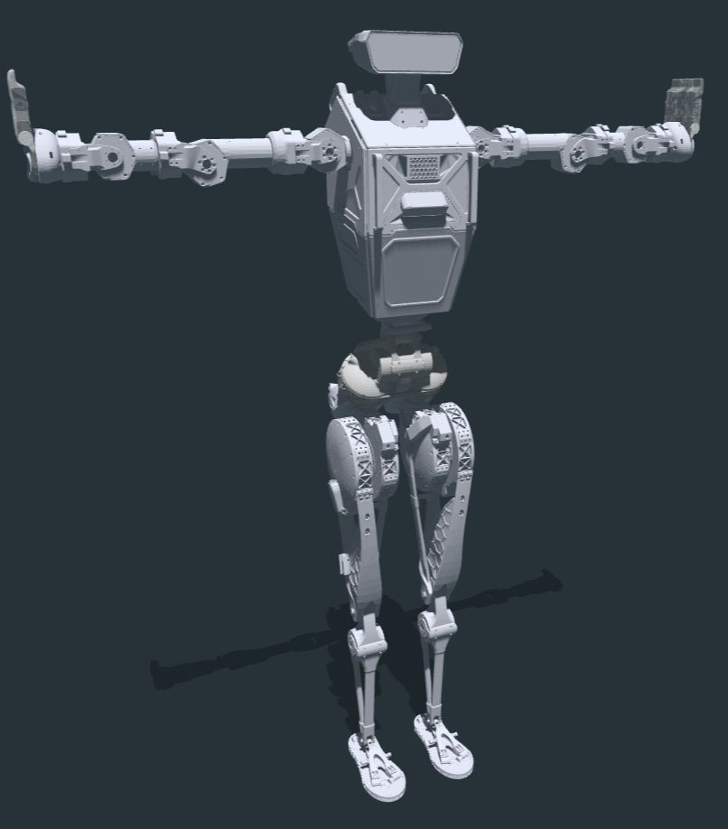
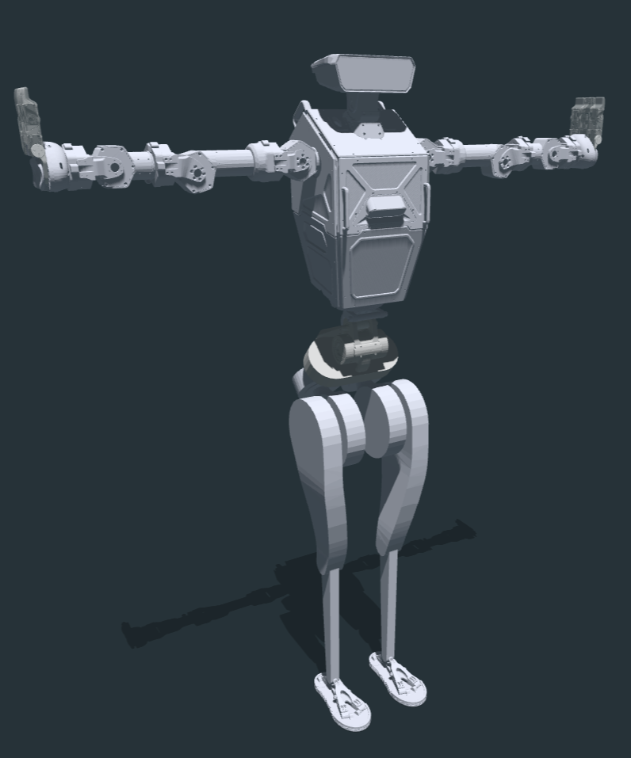

# THEMIS Models for Simulation.

TH02 Gen2.9(TH02.9) is an update based on TH02-A7, adding a three DoFs WAIST to the system. 

TH02 Gen2.9 is an internal model, while TH02-A7 is currently the newest and only model of THEMIS that is beeing mass produced. TH02-A7 is equiped with 7-DoF arms and Westwood Robotics' open source 7-DoF three-finger end-effector [EN02](https://github.com/Westwood-Robotics/EN02-OP). Please note that all other models except for TH02-A7 has been discountinued as of September 25, 2025. 

## Alternative Meshes
### Models
We have included two versions of model mesh files: detailed and simplified, each with different levels of mesh qualities: FHD and HD: 
| Model | FHD | HD | 
| :--: | --| --|
|detailed | High quality mesh Detailed models   Model size: 448 MB | Moderate quality mesh Detailed models   Model size: 58 MB |
|simplified | High quality mesh Simplied leg and body models   Model size: 136 MB | Moderate quality mesh Simplied leg and body models   Model size: 23 MB |

You may use the detailed models for better visual effects, while use the simplied models for lower graphic load on your system, or for simplified collision handling. 

### How to use
All models are located in /alternative_meshes. Copy all files of the mesh model you would like to use and replace the original files in /meshes. 
The default files in /meshes are the HD version of the simplified model.

## Future Updates:
1. Support for IsaacLab and Mujoco
